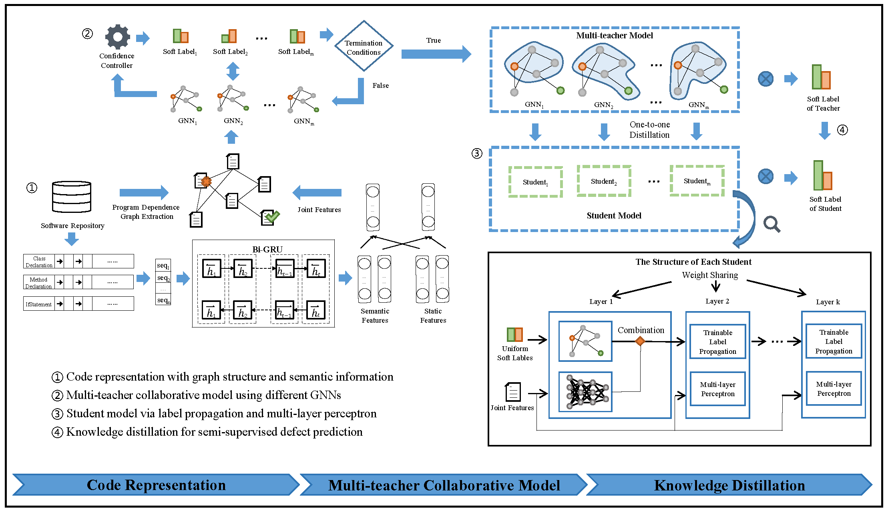

# SeDPGK: Semi-Supervised Software Defect Prediction with Graph Representation Learning and Knowledge Distillation

This repository contains a PyTorch implementation of our proposed approach, SeDPGK, developed by [Wangshu Liu](mailto:liuws0707@gmail.com), Ye Yue, Xiang Chen, Qing Gu, Pengzhan Zhao, Xuejun Liu and Jianjun Zhao.


# Introduction 

Our study presents a novel approach to semi-supervised software defect prediction that integrates program graph representation and knowledge distillation. Several key contributions are included in our approach that aims to improve the accuracy and reliability of defect prediction. First, we design a program graph representation for semi-supervised defect prediction to emphasize the control and data dependencies among modules, which are probably associated with the road of introducing defects. Second, we construct graph neural networks (GNNs) to accurately learn the structure of program dependency graphs and produce trustworthy labels for unlabeled modules, and extend code representation with traditional features and program semantics. Finally, to preserve the sufficient structure and semantic knowledge from the integrated (multi-teacher) model with the help of knowledge distillation, we adopt a trainable label propagation and multi-layer perceptron to develop our final semi-supervised defect prediction (student) model, and mitigate the differences between the teacher and student models using two widely used distillation loss functions.

<div align=center>
    
</div>

# Dependencies
* [DGL](https://www.dgl.ai/)
* [PyTorch](http://pytorch.org/)
* [Understand](https://www.scitools.com/)


# Usage

The code within this repository provides a variety of implementations for graph neural networks as well as the multi-teacher distillation framework. Included in the repository are examples of these implementations using 17 widely-used projects from the PROMISE repository. To run SeDPGK, you will need to download the prerequisite software packages listed in the `requirements.txt` file. Afterward, you can execute the code using the following command:

For **mTCP** (_Algorithm_ 1):
```bash
python mTCP.py --dataset=<DATASET> 
```
For **SeDPGK** (_Algorithm_ 2):
```bash
python or_distillation.py --dataset=<DATASET> 
```
Parameters:

* `dataset` indicates the target project, for example, 'ant-1.7'.


## PROMISE Dataset

| Project name            |  #modules    |  #edges      |   #defective     | Defect rate(%)
| ------------------------|:------------:|:------------:|:----------------:|:----------------:|
| Ant-1.7                 | 745          | 7734         | 166              | 22.3             |
| Camel-1.2               | 608          | 4411         | 216              | 35.5             |  
| Camel-1.6               | 965          | 7913         | 188              | 19.5             |  
| Jedit-3.2               | 272          | 1325         | 90               | 33.1             |  
| Log4j-1.0               | 135          | 456          | 42               | 31.1             |  
| Lucene-2.0              | 195          | 901          | 91               | 46.7             | 
| Lucene-2.2              | 247          | 1424         | 144              | 58.3             | 
| Poi-1.5                 | 237          | 1093         | 141              | 59.5             | 
| Poi-2.5                 | 385          | 1963         | 248              | 64.4             | 
| Synapse-1.1             | 222          | 1428         | 60               | 27.0             | 
| Synapse-1.2             | 256          | 2097         | 86               | 33.6             | 
| Velocity-1.4            | 196          | 1544         | 147              | 75.0             | 
| Velocity-1.6            | 229          | 1925         | 78               | 34.1             | 
| Xalan-2.5               | 803          | 2930         | 387              | 48.2             | 
| Xalan-2.6               | 885          | 3131         | 411              | 46.4             | 
| Xerces-1.2              | 440          | 850          | 71               | 16.1             | 
| Xerces-1.3              | 453          | 777          | 69               | 15.2             | 

## Baseline Methods and Their Parameters

Graph convolutional network (GCN) is a classical semi-supervised model that first introduced convolutional neural networks to handle the graph data, which uses 64 as hidden-layer size, 0.8 as dropout probability, and 0.001 as learning rate decay to initialize.

Graph attention network (GAT) designs an attention layer to the graph convolutional network, making the network more sensitive to important information instead of all graph structures, which uses 64 as hidden-layer size, 0.6 as dropout probability, 0.3 as attention dropout probability, and 0.01 as learning rate decay for training.

Approximate personalized propagation of neural predictions (APPNP) employs an approximation strategy to improve GCN by incorporating the topic-sensitive PageRank. Similar to GAT, we use 64 as hidden-layer size, 0.5 as dropout probability, and 0.01 as learning rate decay.

GraphSAGE (SAGE) is an inductive architecture that leverages vector embeddings of nodes by sampling and aggregating feature information from local neighbors. In this study, we use 128 as hidden-layer size, 5 as the sample number, and 0.005 as learning rate decay.

GCNII is a variant of the GCN model using initial residual and identity mapping to relieve the over-smoothing problem. As suggested by Yang et al., we use 64 as the hidden-layer size, 0.6 as the dropout probability, and 0.005 as the learning rate decay.

Mixture model networks (MoNet) applies learnable parameter kernels for extending the traditional convolutional neural networks to non-Euclidean (e.g. graph data) domains, which uses 8 as hidden-layer size, 0.6 as dropout probability, and 0.01 as learning rate decay to parameterize.

## Other Relevant Papers
 
 * [Label propagation based semi-supervised learning for software defect prediction](https://link.springer.com/article/10.1007/s10515-016-0194-x) by Zhang, Zhi-Wu and Jing, Xiao-Yuan and Wang, Tie-Jian
 * [Semi-supervised deep fuzzy c-mean clustering for software fault prediction](https://ieeexplore.ieee.org/abstract/document/8357535/) by Arshad, Ali and Riaz, Saman and Jiao, Licheng and Murthy, Aparna
 * [FRUGAL: Unlocking semi-supervised learning for software analytics](https://ieeexplore.ieee.org/abstract/document/9678617/) by Tu, Huy and Menzies, Tim \[[code](https://github.com/SE-Efforts/SE_SSL)\]
 * [Semi-supervised random forests](https://ieeexplore.ieee.org/abstract/document/5459198/) by Leistner, Christian and Saffari, Amir and Santner, Jakob and Bischof, Horst
 * [Laplacian support vector machines trained in the primal](https://www.jmlr.org/papers/volume12/melacci11a/melacci11a.pdf) by Melacci, Stefano and Belkin, Mikhail \[[code](https://sourceforge.net/projects/lapsvmp)\]
 * [Hydra: Preserving ensemble diversity for model distillation](https://arxiv.org/abs/2001.04694) by Tran, Linh and Veeling, Bastiaan S and Roth, Kevin and Swiatkowski, Jakub and Dillon, Joshua V and Snoek, Jasper and Mandt, Stephan and Salimans, Tim and Nowozin, Sebastian and Jenatton, Rodolphe
 * [Distilling knowledge from ensembles of neural networks for speech recognition](https://www.isca-speech.org/archive_v0/Interspeech_2016/pdfs/1190.PDF) by Chebotar, Yevgen and Waters, Austin
 * [Loss surfaces, mode connectivity, and fast ensembling of DNNs](https://proceedings.neurips.cc/paper/2018/hash/be3087e74e9100d4bc4c6268cdbe8456-Abstract.html) by Garipov, Timur and Izmailov, Pavel and Podoprikhin, Dmitrii and Vetrov, Dmitry P and Wilson, Andrew G \[[code](https://github.com/timgaripov/dnn-mode-connectivity)\]
 * [“In-Network Ensemble”: Deep ensemble learning with diversified knowledge distillation](https://dl.acm.org/doi/abs/10.1145/3473464) by Li, Xingjian and Xiong, Haoyi and Chen, Zeyu and Huan, Jun and Xu, Cheng-Zhong and Dou, Dejing

